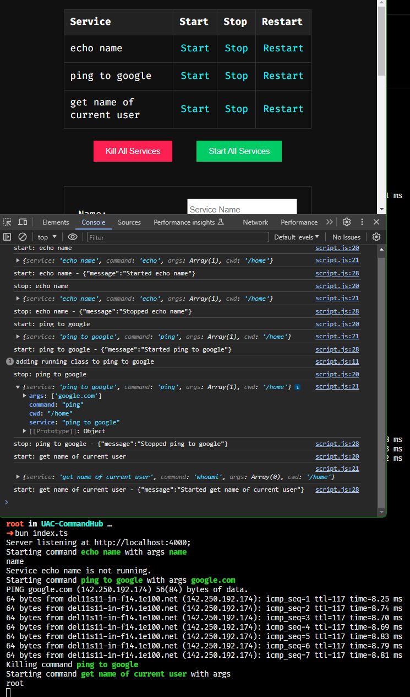

# UAC Command Hub

🌸 UI to API to CLI (UAC) 🌸: I was having trouble running my services from the command line. I wanted to have a UI to manage my services. I also wanted to have an API to manage my services. I also wanted to have a CLI to manage my services. This project is the UI to API to CLI (UAC) for managing services. 🌸

## Introduction

Service Control Panel is an open-source project designed to provide an intuitive and efficient web interface for managing background services on a server. It allows users to start, stop, restart, and view the status of various services dynamically. This project is especially useful for system administrators and developers who need to manage multiple services on their servers.

## Features

-   **Web-based Interface**: Easy-to-use web interface for managing services.
-   **Service Management**: Start, stop, and restart services directly from the browser.
-   **Real-Time Status Updates**: Automatically updates the status of each service.
-   **Service Configuration**: Add new services with customizable settings.
-   **Config Management**: Save and load different service configurations.
-   **Responsive Design**: Works well on both desktop and mobile browsers.

## Prerequisites

-   Node.js (version 12 or later)
-   npm (usually comes with Node.js)

## Installation

1. **Install Dependencies**

    ```bash
    bun install
    ```

2. **Start the Server**

    ```bash
    bun run index.ts
    ```

3. Open `http://localhost:4000` in your web browser and watch the console of the browser for output.

    

## Usage

-   **Viewing Services**: The main table displays all the services with options to start, stop, and restart.
-   **Adding a Service**: Use the form at the bottom of the page to add new services. Specify the service name, command, arguments, and working directory.
-   **Managing Services**: Click on `Start`, `Stop`, or `Restart` beside any service to manage it.
-   **Global Controls**: Use the `Kill All Services` and `Start All Services` buttons for bulk actions.
-   **Configuration Management**: Save and load configurations using the `Save Config` and `Load Config` buttons.

## API Endpoints

-   **`POST /:action`**: Perform actions like 'start', 'restart', 'kill-all', 'start-all', 'stop', 'list'.
-   **`GET /ping`**: Health check endpoint.

## Contributing

Contributions are welcome! Please read our contributing guidelines and submit pull requests to our GitHub repository.

## Support

If you encounter any issues or have questions, please file an issue on the GitHub repository.

## License

This project is licensed under the [MIT License](https://opensource.org/licenses/MIT) - see the LICENSE file for details.
